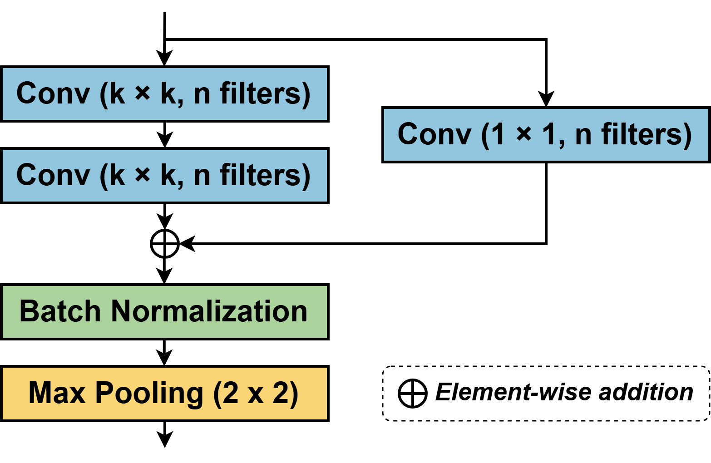
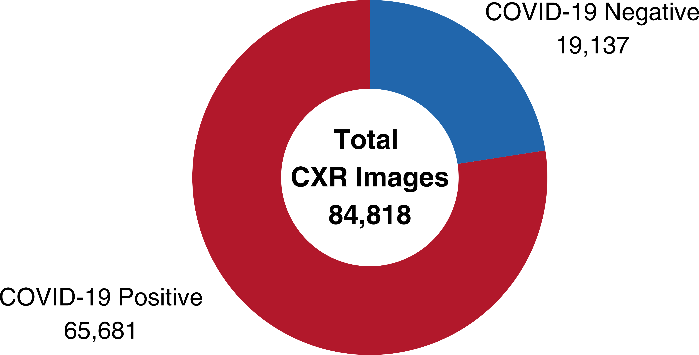

# DLR-CovNet: Dual-Scale Lightweight Residual Network for Efficient COVID-19 Classification

<p align="center">
  <strong>A lightweight deep learning framework for automated COVID-19 detection from chest X-ray (CXR) images.</strong>
</p>

<p align="center">
  📄 <strong>Published in:</strong> Springer | CICBA 2025 <br>
  🔗 <strong>Paper:</strong> <a href="https://doi.org/10.1007/978-3-032-17181-8_5">https://doi.org/10.1007/978-3-032-17181-8_5</a>
</p>

---

## Overview

DLR-CovNet is a lightweight convolutional neural network designed for binary COVID-19 classification from chest X-ray (CXR) images. The proposed architecture combines dual-scale feature extraction with residual learning to capture both local and global radiographic features while maintaining a compact model suitable for deployment in resource-constrained environments.

This work was developed as part of my M.E. research and has been published by **Springer**.

> **Note:** This repository accompanies the published research paper and serves as a research portfolio. It provides a high-level overview of the proposed methodology while intentionally omitting certain implementation details described in the publication.

---

## Research Contributions

The proposed DLR-CovNet introduces several architectural improvements for efficient COVID-19 classification:

* Lightweight CNN with only **2.22 million trainable parameters**
* Dual-scale feature extraction using parallel **3×3** and **5×5** convolution kernels
* Novel **Residual Dual-Conv Pooling (RDCP)** blocks
* Residual learning for improved feature propagation
* Global Average Pooling (GAP) for parameter-efficient classification
* Inverse Class Frequency Re-weighting to address dataset imbalance

The proposed architecture achieves competitive classification performance while remaining significantly smaller than many commonly used deep learning models.

---

## Model Architecture

The overall architecture of the proposed **DLR-CovNet** is illustrated below.

<p align="center">
  
</p>

### Residual Dual-Conv Pooling (RDCP) Block

The RDCP block serves as the fundamental building block of DLR-CovNet. It integrates dual sequential convolutions, residual connections, batch normalization, and max pooling to enable efficient multi-scale feature learning.

<p align="center">
  
</p>

---

## Dataset

The proposed model was evaluated using the **COVIDx CXR-4** dataset.

### Dataset Details

* **Dataset:** COVIDx CXR-4
* **Task:** Binary COVID-19 Classification
* **Input Resolution:** 224 × 224 grayscale chest X-ray images
* **Total Images:** 84,818

The dataset exhibits a significant class imbalance, which was addressed using **Inverse Class Frequency Re-weighting** during training.

<p align="center">
  
</p>

---

## Experimental Results

| Metric                                 |      Score |
| :------------------------------------- | ---------: |
| Accuracy                               | **92.51%** |
| Precision                              | **91.61%** |
| Recall                                 | **93.60%** |
| F1-Score                               | **92.59%** |
| Matthews Correlation Coefficient (MCC) | **85.00%** |
| AUC-ROC                                | **98.12%** |

---

## Repository Structure

```text
DLR-CovNet
│
├── README.md
├── requirements.txt
│
├── src
│   ├── config.py
│   ├── model.py
│   ├── data_loader.py
│   ├── train.py
│   └── evaluate.py
│
├── images
│   ├── architecture.png
│   ├── rdcp_block.png
│   └── class_distribution.png
```

---

## Publication

The complete methodology, architectural design, implementation details, experimental analysis, and comparative evaluation are available in the published Springer paper.

**Paper Title**

> **DLR-CovNet: Dual-Scale Lightweight Residual Network for Efficient COVID-19 Classification**

---

## Citation

If you use or reference this work, please cite:

```bibtex
@inproceedings{nayak2025dlrcovnet,
  author    = {Akash Nayak and Anasua Sarkar},
  title     = {DLR-CovNet: Dual-Scale Lightweight Residual Network for Efficient COVID-19 Classification},
  booktitle = {Computational Intelligence in Image and Signal Processing},
  publisher = {Springer},
  year      = {2025},
  doi       = {10.1007/978-3-032-17181-8_5}
}
```

---

## Contact

**Akash Nayak**

📧 **Email:** [akashncse@gmail.com](mailto:akashncse@gmail.com)

---

## Disclaimer

This repository is intended for research demonstration and portfolio purposes. It accompanies the published Springer paper and is **not** intended to serve as the complete research implementation. For the full methodology, experimental setup, and comprehensive evaluation, please refer to the published paper.
