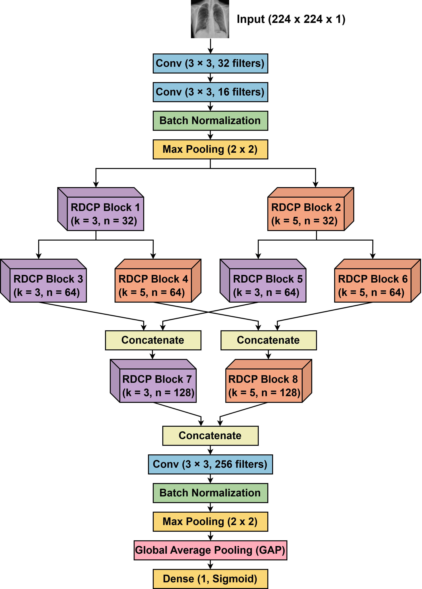

# \# DLR-CovNet: Dual-Scale Lightweight Residual Network for Efficient COVID-19 Classification

# 

# <p align="center">

# <b>A lightweight deep learning framework for automated COVID-19 detection from chest X-ray (CXR) images.</b>

# </p>

# 

# <p align="center">

# 

# 📄 <b>Published in:</b> Springer | CICBA 2025<br>

# 🔗 <b>Paper:</b> https://doi.org/10.1007/978-3-032-17181-8\_5

# 

# </p>

# 

# \---

# 

# \# Overview

# 

# DLR-CovNet is a lightweight convolutional neural network proposed for binary COVID-19 classification from chest X-ray (CXR) images. The architecture combines dual-scale feature extraction with residual learning to effectively capture both fine-grained and high-level radiographic patterns while maintaining a compact model suitable for deployment in resource-constrained environments.

# 

# This work was developed as part of my M.E. research at \*\*Jadavpur University\*\* and has been published by \*\*Springer\*\*.

# 

# > \*\*Note:\*\* This repository accompanies the published research paper and is intended for academic demonstration and portfolio purposes. It provides a high-level overview of the proposed methodology while intentionally omitting certain implementation details described in the publication.

# 

# \---

# 

# \# Research Contributions

# 

# The proposed DLR-CovNet introduces several architectural improvements for efficient COVID-19 classification:

# 

# \- Lightweight CNN with only \*\*2.22 million trainable parameters\*\*

# \- Dual-scale feature extraction using parallel \*\*3×3\*\* and \*\*5×5\*\* convolution kernels

# \- Novel \*\*Residual Dual-Conv Pooling (RDCP)\*\* blocks

# \- Residual learning for improved feature propagation

# \- Global Average Pooling (GAP) for parameter-efficient classification

# \- Inverse Class Frequency Re-weighting for handling dataset imbalance

# 

# The proposed architecture achieves competitive performance while remaining significantly smaller than widely used deep learning models, making it suitable for deployment in resource-constrained environments.

# 

# \---

# 

# \# Model Architecture

# 

# The overall architecture of the proposed \*\*DLR-CovNet\*\* is illustrated below.

# 

# <p align="center">

# &#x20;   

# </p>

# 

# \## Residual Dual-Conv Pooling (RDCP) Block

# 

# The Residual Dual-Conv Pooling (RDCP) block forms the fundamental building block of DLR-CovNet. It combines dual sequential convolutions, residual connections, batch normalization, and max pooling to enable efficient multi-scale feature extraction while maintaining computational efficiency.

# 

# <p align="center">

# &#x20;   

# </p>

# 

# \---

# 

# \# Dataset

# 

# The proposed model was evaluated using the \*\*COVIDx CXR-4\*\* dataset.

# 

# \### Dataset Details

# 

# \- \*\*Dataset:\*\* COVIDx CXR-4

# \- \*\*Task:\*\* Binary COVID-19 Classification

# \- \*\*Input Resolution:\*\* 224 × 224 grayscale chest X-ray images

# \- \*\*Total Images:\*\* 84,818

# 

# The dataset exhibits a significant class imbalance, which was addressed using \*\*Inverse Class Frequency Re-weighting\*\* during model training.

# 

# <p align="center">

# &#x20;   

# </p>

# 

# \---

# 

# \# Experimental Results

# 

# | Metric | Score |

# |:---------------------------------------|------:|

# | Accuracy | \*\*92.51%\*\* |

# | Precision | \*\*91.61%\*\* |

# | Recall | \*\*93.60%\*\* |

# | F1-Score | \*\*92.59%\*\* |

# | Matthews Correlation Coefficient (MCC) | \*\*85.00%\*\* |

# | AUC-ROC | \*\*98.12%\*\* |

# 

# \---

# 

# \# Repository Structure

# 

# ```text

# DLR-CovNet

# │

# ├── README.md

# ├── requirements.txt

# │

# ├── src

# │   ├── config.py

# │   ├── model.py

# │   ├── data\_loader.py

# │   ├── train.py

# │   └── evaluate.py

# │

# ├── images

# │   ├── architecture.png

# │   ├── rdcp\_block.png

# │   └── class\_distribution.png

# │

# └── paper

# &#x20;   └── citation.bib

# ```

# 

# \---

# 

# \# Publication

# 

# The complete methodology, implementation details, architectural analysis, ablation studies, comparative evaluation, and Grad-CAM visualizations are available in the published Springer paper.

# 

# \*\*Paper Title\*\*

# 

# > \*\*DLR-CovNet: Dual-Scale Lightweight Residual Network for Efficient COVID-19 Classification\*\*

# 

# \---

# 

# \# Citation

# 

# If you use or reference this work, please cite:

# 

# ```bibtex

# @inproceedings{nayak2025dlrcovnet,

# &#x20; author    = {Akash Nayak and Anasua Sarkar},

# &#x20; title     = {DLR-CovNet: Dual-Scale Lightweight Residual Network for Efficient COVID-19 Classification},

# &#x20; booktitle = {Computational Intelligence in Image and Signal Processing},

# &#x20; publisher = {Springer},

# &#x20; year      = {2025},

# &#x20; doi       = {10.1007/978-3-032-17181-8\_5}

# }

# ```

# 

# \---

# 

# \# Contact

# 

# \*\*Akash Nayak\*\*

# 

# 📧 \*\*Email:\*\* akashncse@gmail.com

# 

# \---

# 

# \## Disclaimer

# 

# This repository is intended for research demonstration and portfolio purposes. It accompanies the published Springer paper and is not intended to serve as the complete research implementation. For the full methodology, experimental setup, and comprehensive evaluation, please refer to the published paper.

